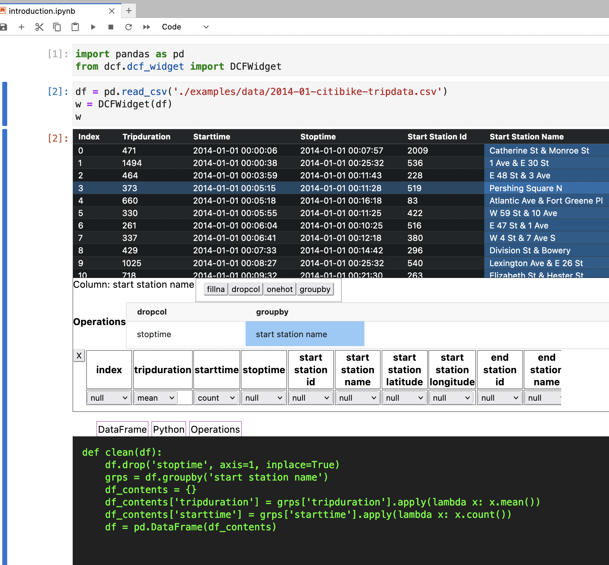

# Buckaroo - The Data Wrangling Assistant
We all know how awkward it is to clean data in jupyter notebooks.  Multiple cells of exploratory work, trying different transforms, looking up different transforms, adhoc functions that work in one notebook and have to be either copied/pasta-ed to the next notebook, or rewritten from scratch.  Buckaro makes all of that better by providing a visual UI for common cleaning operations AND emitting python code that performs the transformation. Specifically, the Buckaroo is a tool built to interactively explore, clean, and transform pandas dataframes.




## Installation

If using JupyterLab, `buckaroo` requires JupyterLab version 3 or higher.

You can install `buckaroo` using `pip`

Using `pip`:

```bash
pip install buckaroo
```

## Documentation

To get started with using Buckaroo, check out the full documentation:

https://buckaroo.readthedocs.io/


# Using Buckaroo

in a jupyter lab notebook just add the following to a cell

```python
from buckaroo.buckaroo_widget import BuckarooWidget
BuckarooWidget(df=df)  #df being the dataframe you want to explore
``` 
and you will see the UI for Buckaroo


## Using commands

At the core Buckaroo commands operate on columns.  You must first click on a cell (not a header) in the top pane to select a column.

Next you must click on a command like `dropcol`, `fillna`, or `groupby` to create a new command

After creating a new command, you will see that command in the commands list, now you must edit the details of a command.  Select the command by clicking on the bottom cell.

At this point you can either delete the command by clicking the `X` button or change command parameters.

## Writing your own commands

Builtin commands are found in [all_transforms.py](buckaroo/all_transforms.py)

### Simple example
Here is a simple example command
```python
class DropCol(Command):
    command_default = [s('dropcol'), s('df'), "col"]
    command_pattern = [None]

    @staticmethod 
    def transform(df, col):
        df.drop(col, axis=1, inplace=True)
        return df

    @staticmethod 
    def transform_to_py(df, col):
        return "    df.drop('%s', axis=1, inplace=True)" % col
```
`command_default` is the base configuration of the command when first added, `s('dropcol')` is a special notation for the function name.  `s('df')` is a symbol notation for the dataframe argument (see LISP section for details).  `"col"` is a placeholder for the selected column.

since `dropcol` does not take any extra arguments, `command_pattern` is `[None]`
```python
    def transform(df, col):
        df.drop(col, axis=1, inplace=True)
        return df
```
This `transform` is the function that manipulates the dataframe.  For `dropcol` we take two arguments, the dataframe, and the column name.

```python
    def transform_to_py(df, col):
        return "    df.drop('%s', axis=1, inplace=True)" % col
```
`transform_to_py` emits equivalent python code for this transform.  Code is indented 4 space for use in a function.

### Complex example
```python
class GroupBy(Transform):
    command_default = [s("groupby"), s('df'), 'col', {}]
    command_pattern = [[3, 'colMap', 'colEnum', ['null', 'sum', 'mean', 'median', 'count']]]
    @staticmethod 
    def transform(df, col, col_spec):
        grps = df.groupby(col)
        df_contents = {}
        for k, v in col_spec.items():
            if v == "sum":
                df_contents[k] = grps[k].apply(lambda x: x.sum())
            elif v == "mean":
                df_contents[k] = grps[k].apply(lambda x: x.mean())
            elif v == "median":
                df_contents[k] = grps[k].apply(lambda x: x.median())
            elif v == "count":
                df_contents[k] = grps[k].apply(lambda x: x.count())
        return pd.DataFrame(df_contents)
```
The `GroupBy` command is complex.  it takes a 3rd argument of `col_spec`.  `col_spec` is an argument of type `colEnum`.  A `colEnum` argument tells the UI to display a table with all column names, and a drop down box of enum options.

In this case each column can have an operation of either `sum`, `mean`, `median`, or `count` applied to it.

Note also the leading `3` in the `command_pattern`.  That is telling the UI that these are the specs for the 3rd element of the command.  Eventually commands will be able to have multiple configured arguments.

### Argument types
Arguments can currently be configured as 

* `integer` - allowing an integer input
* `enum` - allowing a strict set of options, returned as a string to the transform
* `colEnum` - allowing a strict set of options per column, returned as a dictionary keyed on column with values of enum options


## Order of Operations for data cleaning
The ideal order of operations is as follows

* Column level fixes
  * drop (remove this column)
  * fillna (fill NaN/None with a value)
  * safe int (convert a colum to integers where possible, and nan everywhere else)
  * OneHotEncoding ( create multiple boolean columns from the possible values of this column )
  * MakeCategorical ( change the values of string to a Categorical Data type)
  * Quantize
* DataFrame transformations
these transforms largely keep the shape of the data the same

  * Resample
  * ManyColdDecoding (the opposite of OneHotEncoding, take multiple boolean columns and transform into a single categorical
  * Index shift (add a column with the value from previous row's column)
* Dataframe transformations 2
These result in a single new dataframe with a vastly different shape
  * Stack/Unstack columns
  * GroupBy (with UI for sellect group by function for each column)
* DataFrame transformations 2
These transforms emit multiple DataFrames
  * Relational extract (extract one or more columns into a second dataframe that can be joined back to a foreign key column)
  * Split on column (emit separate dataframes for each value of a categorical, no shape editting)
* DataFrame combination
  * concat (concatenate multiple dataframes, with UI affordances to assure a similar shape)
  * join (join two dataframes on a key, with UI affordances)

Buckaroo can only work on a single input dataframe shape at a time.  Any newly created columns are visible on output, but not available for manipulation in the same Buckaroo Cell.


# Components
* a rich table widget that is embeddable into applications and in the jupyter notebook.
* A UI for selecting and trying transforms interactively
* An output table widget showing the transformed dataframe


# What works now, what's coming

## Exists now
  * React frontend app
    * Displays a datatframe
	* Simple UI for column level functions
	* Shows generated python code
	* Shows transformed data frame
  * Buckaroo server
    * Serves up dataframes for use by frontend
	* responds to buckaroo commands
	* shows generated python code
  * Developer User experience
	* define Buckaroo commands in python onloy
  * Buckaroo Intepreter
    * Based on Peter Norvig's lispy.py, a simple syntax that is easy for the frontend to generate (no parens, just JSON arrays)
  * Buckaroo core (actual transforms supported)
    * dropcol
	* fillna
	* one hot
	* safe int
	* GroupBy

## Next major features
  * Jupyter Notebook widget
    * embed the same UI from the frontend into a jupyter notebook shell
	* No need to fire up a separate server, commands sent via ipywidgets.comms
	* Add a "send generated python to next cell" function
  * React frontend app
    * Styling
	  * Server only, some UI for DataFrame selection
    * Pre filtering concept (only operate on first 1000 rows, some sample of all rows)
	* DataFrame joining UI
	* Summary statistics tab for incoming dataframe
	* Multi index columns
	* DateTimeIndex support
  * Buckaroo core
	* MakeCategorical
	* Quantize
	* Resample
	* ManyColdDecoding
	* IndexShift
	* Computed
	* Stack/Unstack
	* RelationalExtract
	* Split
	* concat
	* join
	


## Development installation

For a development installation:

```bash
git clone https://github.com/paddymul/buckaroo.git
cd buckaroo
conda install ipywidgets=8 jupyterlab
pip install -ve .
```

Enabling development install for Jupyter notebook:


Enabling development install for JupyterLab:

```bash
jupyter labextension develop . --overwrite
```

Note for developers: the `--symlink` argument on Linux or OS X allows one to modify the JavaScript code in-place. This feature is not available with Windows.
`

## Contributions

We :heart: contributions.

Have you had a good experience with this project? Why not share some love and contribute code, or just let us know about any issues you had with it?

We welcome issue reports [here](../../issues); be sure to choose the proper issue template for your issue, so that we can be sure you're providing the necessary information.

Before sending a [Pull Request](../../pulls), please make sure you read our


