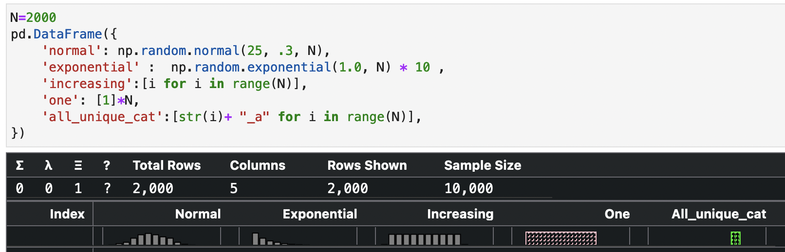
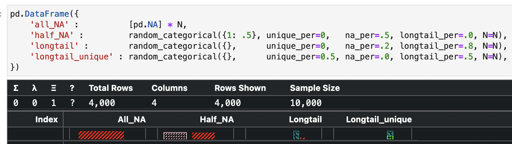
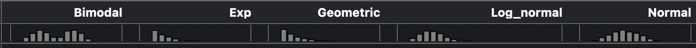

.. _using:

==========
Histograms
==========

Buckaroo uses histograms to convey the general shape of a colum in the minimum amount of screen real estate.  Like the rest of buckaroo, this is an opionated feature that can be overridden with your own preferences.

Interpreting Buckaroo histograms by example
==============================
Histograms in buckaroo are designed to give you a rough understanding of the distribution of values in a column at a glance.  This can tell you important things like "is this an ID column?" "is this a categorical column".  The following pictures give some context.

Common patterns
---------------

This picture shows 5 common column types.

* ``normal`` shows a numerical column with random (unordered) values from the standard distribution
* ``exponential`` shows a numerical column with random unorderd values from the exponential distribution
* ``increasing`` shows all numbers from 1 to 2000 ordered.
* ``one`` shows a column where every value is "1".  This is displayed in pink with a pattern because the histogram treats it as a categorical histogram even though it is a numerical column
* ``all_unique_cat`` shows the histogram for a string column where each value is different.  This is a categorical histogram

Categorical patterns
--------------------
	
Buckaroo has special colors and patterns for categorical type columns.  Categoricals are always displayed in decreasing order with the most frequent value on the left.  There are other special columns.  Unique and longtail are stacked.  Longtail is the sum of occurences of every value that is not unique, and is not one of the 7 most frequent categories.  Unique is the bar for values that occur only once.

Numeric columns with less than 5 values are treated as categoricals.  The thinking was that a limited number of values in a numeric column probably represented some type of flag field, and not a true measurement.

* ``all_NA`` has only NA/NaN values.  The red cross hatch takes up the entire histogram area
* ``half_NA`` has half NA values and the other half is filled with ``1``.
* ``longtail`` has 80% longtail values and 20% NA
* ``longtail_unique`` has half longtail values and half unique values.  Note that the bars are stacked

Numeric patterns
----------------

Numeric histograms work mostly as expected. One thing to note, there is a separate bar for the 1st and last percentile of values.  This filters out extreme values and gives much more resolution to the middle 98% of data. With such a small area, this seemed like the best approach.

* ``bimodal`` shows a bimodal distribution
* ``Exp`` shows an exponential distribution
* ``geometric`` shows a geometric distribution.  Note that this is very difficult to decipher from an exponential distribution, probably due to outlier filters and limited resolution.

Other research
==============

https://edwinth.github.io/blog/outlier-bin/

references

        Boris Iglewicz and David Hoaglin (1993), "Volume 16: How to Detect and
        Handle Outliers", The ASQC Basic References in Quality Control:
        Statistical Techniques, Edward F. Mykytka, Ph.D., Editor.

	
