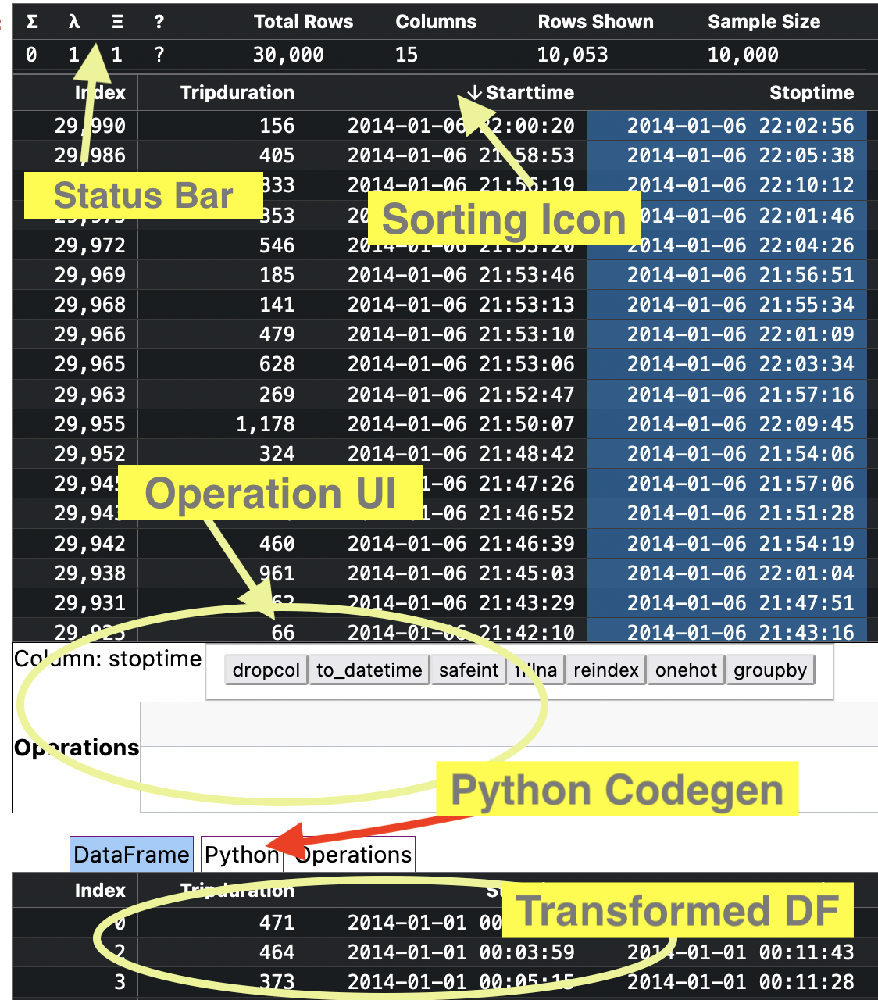
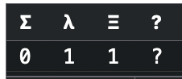

.. _Feature_reference:

=================
Feature Reference
=================

Full App Diagram
================

Status Bar Features
===================
The status bar is displayed above every table, it allows quick toggling of different UI modes

Σ Summary Statistics
--------------------

To View Summary Statistics click on the ``Σ`` cell .  When the value below is ``1``, the summary stats view will be show in the table.

λ Command Editting Mode
-----------------------

To turn on Command Editting mode, click on the ``λ`` cell.  This will bring up the command UI and the transformed dataframe view

Ξ Sampled Data Mode
-------------------

When a dataframe has more than 10k rows, Bucakroo inteligently downsamples the dataframe to only 10k rows + extents for each column.  Sometimes you want to see the entire dataframe, toggling the ``Ξ`` cell enables this.  Turning off sampling for large datasets can cause the table to take a long time to render, so use with caution.

? Help
------

Click the ``?`` cell to display this document.

Other Features
==============

Sort by a column
----------------

To sort the dataframe by any column, click on the header for that column, sorting will cycle through ``ascending``, ``descending`` and ``off``

Operations UI
-------------

The operations UI allows quick manipulation of dataframes.  Commands operate on columns.  First click on the column you want to operate on, then click on the command.  This command will be added to the "operations" list.  Some commands take extra arguments (fillna, groupby) and these must be provided via the UI.  The transformed dataframe is instantly updated below. Further you can click the ``python`` tab to see generated python code that will perform the same transform.

Disabling Dataframe Autodisplay
-------------------------------

When you run ``import buckaroo`` the Buckaroo widget is automatically registered with the jupyter notebook as the default display mechanism for objects of type ``pd.DataFrame``.  Occasionally you will run into bugs with Buckaroo, that prevent the table from working.  Please file a bug at `Buckaroo issues <https://github.com/paddymul/buckaroo/issues>`_ .  You can restore the default pandas behavior with

.. code-block:: python

    import buckaroo
    buckaroo.disable()

